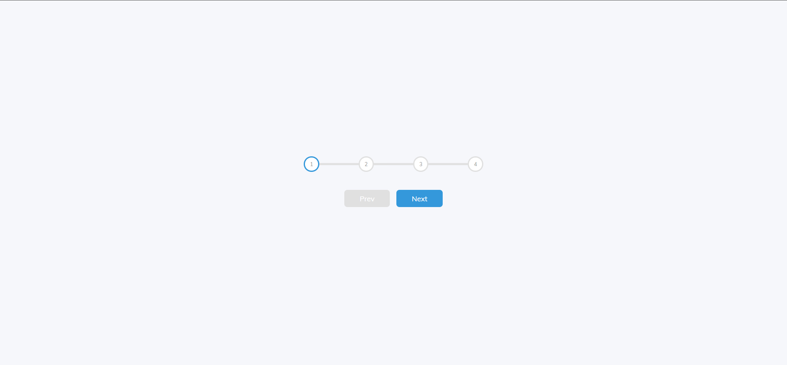
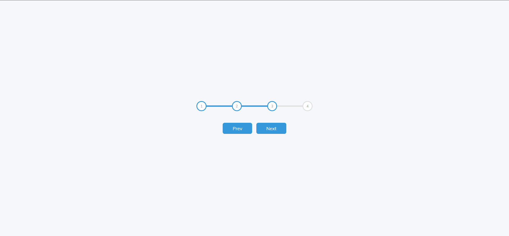

# Progress Steps

This is a solution to the progress steps mini project.

## Table of contents

- [Overview](#overview)
  - [Screenshot](#screenshot)
  - [Links](#links)
- [My process](#my-process)
  - [Built with](#built-with)
  - [What I learned](#what-i-learned)
  - [Continued development](#continued-development)
  - [Useful resources](#useful-resources)
- [Author](#author)
- [Acknowledgments](#acknowledgments)

## Overview

This is my solution to the progress steps mini project used to learn and test a
few HTML, CSS and JavaScript skills...

### Screenshot




### Links

- Solution URL: [GitHub](https://github.com/newbpydev/02-progress-steps)
- Live Site URL: [Live Site](https://epic-sinoussi-1bd9ac.netlify.app/)

## My process

### Built with

- Semantic HTML5 markup
- CSS custom properties
- Flexbox

### What I learned

I have learned on this project more about making a site more interactive and how
to manipulate the DOM with js.

```css
:root {
  --line-border-fill: #3498db;
  --line-border-empty: #e0e0e0;
}
.progress-container::before {
  content: '';
  background-color: var(--line-border-empty);
  position: absolute;
  top: 50%;
  left: 0;
  transform: translateY(-50%);
  height: .4rem;
  width: 100%;
  z-index: -1;
}
```

### Continued development

For future development, I will continue to train using js and add more
interactivity to sites.

### Useful resources

- [MDN - var()](https://developer.mozilla.org/en-US/docs/Web/CSS/var()) - The var() CSS function can be used to insert the value of a custom property (sometimes called a "CSS variable") instead of any part of a value of another property.

## Author

- Website - [Juan Gomez](https://www.newbpydev.com)
- Twitter - [@Newb_PyDev](https://twitter.com/Newb_PyDev)

## Acknowledgments

The code may not be perfect compared to my sensei @jonasschmedtman but I need
to thank him because he has shown me the ropes and now I am a confident web
designer.


